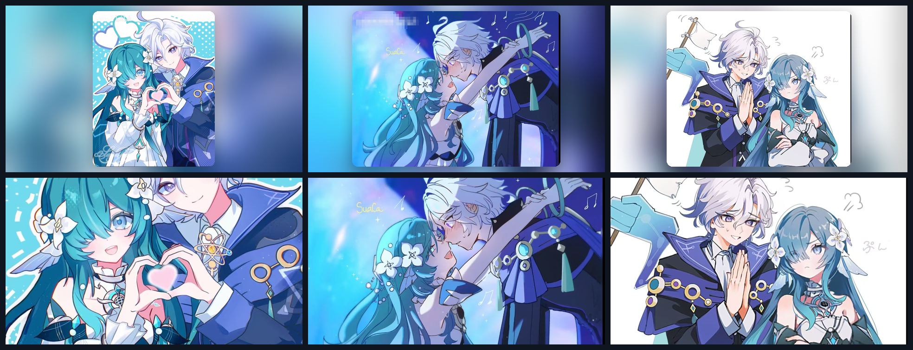

# 💙 原神 CP 壁纸套件 1 · 米提亚 × 沃雅妮莎

**单张样式**壁纸包: 3 张同人插画一键切换 / 可视化切换器 / 桌面桌宠 / 多 IDE 皮肤。
素材内置于发行包, **离线可用**; 跨平台 Windows / macOS / Linux。



## ✨ 全部样式

| 样式 id | 名称 | 画面 | 处理方式 |
|---|---|---|---|
| `single1` | **比心**(默认) | 双手合心 · 蓝色波点 | 模糊填充背景 + 居中圆角卡片, **不裁切** |
| `single2` | 共舞 | 夜色执手共舞 · 音符星光 | 同上 |
| `single3` | 道歉 | 举白旗道歉 · 少女抱臂 | 同上 |
| `cover1` | 比心 · 满屏 | 同上 | cover 裁切铺满整屏, 无边框 |
| `cover2` | 共舞 · 满屏 | 同上 | 同上 |
| `cover3` | 道歉 · 满屏 | 同上 | 同上 |

> `single*` 会完整保留构图(竖图/横图都不裁掉内容), 四周用同色系重模糊做氛围底;
> `cover*` 满屏无边框, 横图观感最佳, 竖图会裁掉上下。

## 🚀 给 AI 一句话安装

把本仓库链接发给**任意 AI**(DeepKing、Claude Code、Kimi Code、CodeX、Trae、Cursor、
JetBrains AI、DSH Harness 等), 它会读 [`AGENTS.md`](AGENTS.md) 替你装完:

```text
请安装 https://github.com/WPH666-py/Genshen-Skin-CP1 的原神CP壁纸
```

装了 MCP 后 AI 还能**直接调工具**换壁纸(见下方 IDE 支持表)。

## 🖥️ 手动安装

要求: Python 3.9+。Pillow 缺失时脚本会自动 `pip install`。

```bash
# 方式一: pip(推荐, 素材已打进包)
pip install genshin-skin-cp1
genshin-cp1-install          # 一键: 生成壁纸 + 设为桌面 + 注册已装 IDE

# 方式二: 源码
git clone https://github.com/WPH666-py/Genshen-Skin-CP1.git
cd Genshen-Skin-CP1
python -m genshin_skin_cp1.autoinstall
```

国内镜像源(清华 / 阿里 / 中科大 任选):

```bash
pip install genshin-skin-cp1 -i https://pypi.tuna.tsinghua.edu.cn/simple
pip install genshin-skin-cp1 -i https://mirrors.aliyun.com/pypi/simple
pip install genshin-skin-cp1 -i https://pypi.mirrors.ustc.edu.cn/simple
```

> 这三个都是 **PyPI 的下载镜像**, 会自动同步官方包, 无需单独发布。
> 本包已发布到官方 PyPI: <https://pypi.org/project/genshin-skin-cp1/>

Windows 用户也可以直接双击 `install.bat`。

## 🎨 常用命令

```bash
genshin-cp1 1              # 换成第 1 张(比心)
genshin-cp1 2              # 换成第 2 张(共舞)
genshin-cp1 3              # 换成第 3 张(道歉)
genshin-cp1 cover2         # 第 2 张满屏版
genshin-cp1 random         # 随机来一张
genshin-cp1 list           # 列出所有样式
genshin-cp1 switcher       # 可视化切换器(预览 + 一键应用 + 自动随机)
genshin-cp1 pet            # 桌面桌宠(拖动 / 右键换立绘 / Esc 退出)
genshin-cp1 cycle 30       # 每 30 分钟自动随机换壁纸
genshin-cp1 all --out DIR  # 生成全部 6 种到指定目录
genshin-cp1 info           # 环境与素材自检
```

常用选项: `--size 2560x1440` 指定分辨率(默认取屏幕分辨率)、`--no-set` 只生成不设置。
也可用环境变量 `GENSHIN_CP1_SIZE=2560x1440`。

## 🧩 IDE / 桌宠支持

| 环境 | 接入方式 |
|---|---|
| **VSCode / Trae / CodeX / Cursor / Windsurf** | 活动栏「原神CP1」→ 皮肤画廊一键换壁纸; 命令面板搜 `原神CP1` |
| **PyCharm / WebStorm / IntelliJ** | Settings → Appearance & Behavior → Appearance → **Background Image** |
| **DeepKing / Claude Code / Kimi Code / Harness / CodeX** | 注册 MCP 服务器, AI 直接调 `set_wallpaper` / `next_wallpaper` |
| **桌面桌宠** | `genshin-cp1 pet` —— 透明置顶圆形立绘, 可拖动、右键换图 |
| **DeepKing** | 设置 → 界面皮肤 → 粘贴本仓库地址, 自动生成蓝调配色皮肤 |

一键注册全部已装 IDE:

```bash
genshin-cp1-install --only vscode jetbrains mcp
```

MCP 手动配置(写入配置文件的 `mcpServers`):

```json
{
  "mcpServers": {
    "genshin-cp1": {
      "command": "python",
      "args": ["-m", "genshin_skin_cp1.mcp_server"]
    }
  }
}
```

## 📁 目录

```
src/genshin_skin_cp1/
  config.py       标识、素材清单、样式表(改这里即可复用成别的套件)
  skin_core.py    合成 / 跨平台壁纸设置 / 热更新 / 素材双形态定位
  cli.py          命令行
  switcher.py     可视化切换器(Tkinter)
  pet.py          桌面桌宠(Tkinter)
  mcp_server.py   MCP 服务器(JSON-RPC over stdio, 纯标准库)
  autoinstall.py  自动安装 + IDE 探测注册
  assets/         3 张素材
vscode/           VSCode/Trae/CodeX 扩展(含打包好的 .vsix)
ide/jetbrains/    JetBrains 背景图指引
AGENTS.md         给 AI 的自动安装指引(装完即可让 AI 替你换壁纸)
```

## ❓ 常见问题

- **壁纸尺寸**: 默认取主屏分辨率; 多显示器建议加 `--size 2560x1440` 并在系统设置里把壁纸设为「平铺/跨屏」。
- **命令找不到**: Scripts 目录不在 PATH, 改用 `python -m genshin_skin_cp1.cli`。
- **Python 缺失**: Windows `winget install Python.Python.3.11`; macOS `brew install python`;
  Ubuntu `sudo apt install python3 python3-pil`。
- **桌宠不透明**: 个别 Linux 桌面不支持透明色键, 会退化为白底卡片, 功能不受影响。
- **切换器/桌宠没反应**: 两者需要本地图形桌面, 远程 SSH 会话下无法显示。
- **改了素材不生效**: 不会 —— 素材或代码更新后会自动重新合成(热更新), 无需清缓存。

## 🔗 与其它套件的关系

与 WPH666-py 的其它皮肤套件(`AI-Family-Skin-Suit*`、`Deepseek-Skin-Suit*`、`DeepKing-Plugin`)
**完全独立**: 包名 `genshin-skin-cp1`、命令前缀 `genshin-cp1`、运行时目录 `~/.genshin-cp1`
互不冲突, 可同时安装、各自切换。

## 🙏 素材说明

3 张米提亚 × 沃雅妮莎同人插画, 原始文件 sha256 记录在
[`src/genshin_skin_cp1/assets/SOURCE.txt`](src/genshin_skin_cp1/assets/SOURCE.txt)。
**仅用于个人桌面美化, 请勿二次商用。** 版权归原作者所有。

## 📄 许可

代码以 MIT 许可发布(见 [LICENSE](LICENSE)); 插画素材不在 MIT 授权范围内。
